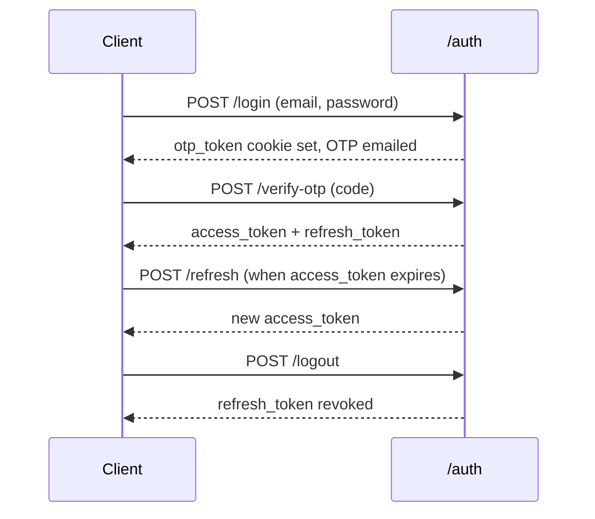

<div align="center">

# 🎓 University System

**A full-stack university management platform** — users & roles, academic structure, timetabling, attendance, grading, push notifications, and a complete audit trail.

<!-- Replace with your own logo/banner if you have one: -->
<!--  -->

[](https://www.python.org/)
[](https://fastapi.tiangolo.com/)
[](https://www.mysql.com/)
[](https://react.dev/)
[](https://vitejs.dev/)
[](#-auth-flow)

[](./LICENSE) 
[]()
[](./CONTRIBUTING.md)

📖 **[Architecture Docs](./ARCHITECTURE.md)** · 🤝 **[Contributing](./CONTRIBUTING.md)** · 🐛 [Report a bug](../../issues)

</div>

---

## 📸 Preview

<!--
  Drop real screenshots/GIFs in .github/assets/ and swap the paths below.
  A quick way to record a GIF of your admin dashboard flow: use
  ScreenToGif (Windows), Kap (Mac), or Peek (Linux) — keep it under
  ~5MB so it loads fast on GitHub.
-->

<div align="center">

| Admin Dashboard | Login + OTP Flow |
|---|---|
|  |  |

</div>

> 🖼️ *Screenshots above are placeholders — see [Adding Your Own Screenshots](#-adding-your-own-screenshots) for how to add real ones.*

---

## ✨ Features

- 👤 **User & Role Management** — admin/dean/teacher/student roles, profile linkage to faculty/department/section
- 🏛️ **Academic Structure** — faculties → departments → programs → cohorts → sections
- 📚 **Curriculum & Assignments** — subjects, teacher↔subject↔section mapping, academic years
- 🗓️ **Timetabling & Lessons** — scheduled slots, lesson instances, attendance per lesson
- 📊 **Grading** — scores per student/subject/assignment
- 🔔 **Push Notifications** — Firebase Cloud Messaging + in-app notification log
- 🕵️ **Full Audit Trail** — every mutation logs actor, before/after state, inside the same DB transaction
- 🔐 **JWT + Email OTP Auth** — access/refresh tokens, Argon2 password hashing, second-factor OTP

---

## 🛠️ Tech Stack

<table>
<tr>
<td valign="top" width="50%">

**Backend**
- ⚡ FastAPI (async) + Uvicorn
- 🐬 MySQL via `aiomysql` (raw SQL, no ORM — see [ARCHITECTURE.md](./ARCHITECTURE.md))
- 🔑 JWT auth (access + refresh) + email OTP
- 🔒 Argon2 password hashing
- 🔥 Firebase Cloud Messaging
- ⚙️ `pydantic-settings` config

</td>
<td valign="top" width="50%">

**Frontend**
- ⚛️ React 19 + Vite
- 🧭 React Router v7 (role-based route guards)
- 📡 Axios

</td>
</tr>
</table>

---

## 📁 Project Structure

```
app/            # FastAPI backend — one folder per domain, each with
                # router.py / service.py / repository.py / schemas.py / exceptions.py
database/       # SQL schema + migrations
frontend/       # React admin/teacher/student SPA
```

📖 Full layout in [ARCHITECTURE.md § Directory Structure](./ARCHITECTURE.md#2-directory-structure).

---

## 🚀 Getting Started

### 1️⃣ Backend

```bash
python -m venv venv
source venv/bin/activate        # Windows: venv\Scripts\activate
pip install -r requirements.txt

cp .env.example .env            # fill in DB / JWT / SMTP / Firebase values
```

Create the database and load the schema:

```bash
mysql -u root -p -e "CREATE DATABASE university_system CHARACTER SET utf8mb4"
mysql -u root -p university_system < database/schema.sql
mysql -u root -p university_system < database/migrations/001_grades_and_audit.sql
```

Run the API:

```bash
uvicorn app.main:app --reload
```

| Endpoint | URL |
|---|---|
| 🩺 Health check | `GET http://localhost:8000/` |
| 📘 Swagger UI | `http://localhost:8000/docs` |
| 📗 ReDoc | `http://localhost:8000/redoc` |
| 🔌 API base path | `/University_system/v1` |

### 2️⃣ Frontend

```bash
cd frontend
npm install
npm run dev
```

Runs on `http://localhost:5173` — make sure it's included in `ALLOWED_ORIGINS` in your backend `.env`.

---

## 👥 Roles

| Role | Access |
|---|---|
| 🛡️ `admin` | Full control — users, faculties, departments, assignments, academic setup |
| 🎓 `dean` | Faculty-level oversight |
| 👨‍🏫 `teacher` | Their own assignments, attendance, grading |
| 🧑‍🎓 `student` | Their own dashboard, grades, attendance |

Role is embedded in the JWT payload and enforced both server-side (`core/dependencies.py` guards) and client-side (`ProtectedRoute` + route nesting in `App.jsx`).

---

## 🔐 Auth Flow



> Send the access token as the raw `Authorization` header value on every request (no `Bearer ` prefix — see [ARCHITECTURE.md § 4](./ARCHITECTURE.md#4-auth--authorization) for why).

---

## 🖼️ Adding Your Own Screenshots

1. Create the assets folder: `mkdir -p .github/assets`
2. Drop in PNGs (screenshots) or GIFs (short flow demos, <5MB each)
3. Swap the placeholder paths in the [Preview](#-preview) table above
4. For GIFs, a screen recorder that trims/compresses well: **ScreenToGif** (Windows), **Kap** (macOS), **Peek** (Linux)

---

## 🤝 Contributing

See [CONTRIBUTING.md](./CONTRIBUTING.md) for the module convention every domain follows and how to add a new one.

